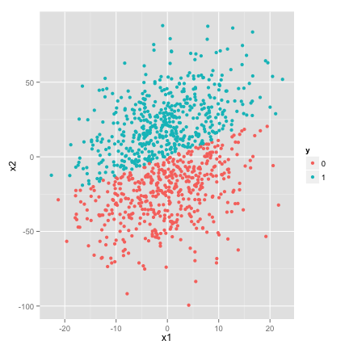
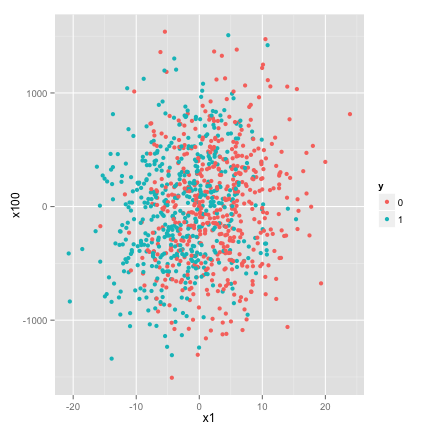

One of the common approaches used when working with big data is 
reducing the number of features through a principal component analysis.
Since it is an unsupervised method though, it may not be a great choice in many 
circumstances. Consider the simple example below
<!-- pca: R code (No Results in Document) -->

```r
source("~/github/imouzon.github.io/Rmarkdown/code_bank/knitrSetup.r")
require(MASS)
require(ggplot2)
require(plyr)
require(reshape2)
library(e1071)
library(randomForest)
library(mvtnorm)

randomCovMat = function(p) {
    k = 10
    R = matrix(runif(p * p), nrow = p)
    R = (R * lower.tri(R) + t(R * lower.tri(R)))
    diag(R) = sort(sample(1:500)[1:p])
    return(R)
}
```


```r
# select the rows and columns
n = 1000
p = 100

# generate X
X = matrix(rnorm(n * p), nrow = n)

# random correlation matrix
R = randomCovMat(p)

# Give the features some correlation structure
X = data.frame(X %*% R)

# name the columns
names(X) = paste0("x", 1:p)

# add the response to our data
X$y = as.factor(1 * (X$x1 < 0 & X$x2 < 0) | (X$x1 > 0 & X$x2 > 0))
X$y = as.factor(1 * (X$x1 < 0.8 * X$x2))
```

This creates a data set with 100 feature dimensions and a binary classification.
However, we create the data so that there is a simple relationship between the
classes and the first two features, x1 and x2.

<!-- class: R plot (results in document) -->

```r
   qplot(x1,x2,color=y,data=X)
```

 

```r
   qplot(x1,x100,color=y,data=X)
```

 


However, with 98 other features to search through, it may be difficult to
identify this relationship immediately, and initially working with this data
we may hope to reduce the data. 

##Principal Components for data reduction

One popular method for data reduction is principal components. 
Consider a data set with each of p features arranged as columns 
of a matrix (giving us an n by p matrix, where n is the number of obsercations the
features are generated by).  We may wish to The basic assumption is 
that for a feature matrix of dimension n by p we can make a set of features 
that the data is and we could build a simple model to capture this behavior:

You may have noticed the data in this case is not comple
<!-- plot: R plot (results in document) -->

```r
   Xmat = as.matrix(X[,1:p])
   rm=rowMeans(Xmat)
   Xnew= Xmat - matrix(rep(rm, ncol(Xmat)), nrow=nrow(Xmat))

   A = Xnew%*%t(Xnew)
   E = eigen(A,TRUE)
   P=t(E$vectors)
   P.X = data.frame(P%*%Xnew)
   names(P.X) = paste0('PC',1:p)
   P.X$y = X$y
```

<!-- 
http://psych.colorado.edu/wiki/lib/exe/fetch.php?media=labs:learnr:emily_-_principal_components_analysis_in_r:pca_how_to.pdf 
-->

<!-- svm: R code (No Results in Document) -->

```r
Xsvm = svm(y ~ ., data = X[1:800, ])
prediction = predict(Xsvm, X[801:1000, ])
table(pred = prediction, true = X$y[801:1000])
```

```
    true
pred  0  1
   0 89 12
   1 13 86
```


```r
Xsvm = svm(y ~ ., data = X[1:800, ])
P.Xsvm = svm(y ~ ., data = P.X[1:800, ])
prediction = predict(P.Xsvm, P.X[801:1000, ])
table(pred = prediction, true = P.X$y[801:1000])
```

```
    true
pred   0   1
   0 102  98
   1   0   0
```


<!-- randomForest: R code (No Results in Document) -->

```r
Xrf = randomForest(y ~ ., data = X[1:800, ], ntree = 1000, nodesize = 9, mtry = 10)
prediction = predict(Xrf, X[801:1000, ])
table(pred = prediction, true = X$y[801:1000])
```

```
    true
pred  0  1
   0 77 26
   1 25 72
```

```r
head(importance(Xrf))
```

```
   MeanDecreaseGini
x1           39.815
x2            9.405
x3            2.611
x4            2.450
x5            2.507
x6            2.488
```


<!-- randomForest: R code (No Results in Document) -->

```r
P.Xrf = randomForest(y ~ ., data = P.X[1:800, ], ntree = 1000, nodesize = 9, 
    mtry = 10)
prediction = predict(P.Xrf, P.X[801:1000, ])
table(pred = prediction, true = P.X$y[801:1000])
```

```
    true
pred  0  1
   0 79 77
   1 23 21
```

```r
head(importance(P.Xrf))
```

```
    MeanDecreaseGini
PC1            2.610
PC2            2.593
PC3            3.227
PC4            2.819
PC5            2.629
PC6            2.812
```


