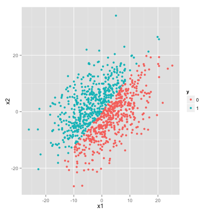
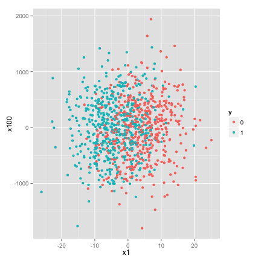

#Principal components for data reduction

One of the common approaches used when working with big data is 
reducing the number of features through a principal component analysis.
Since it is an unsupervised method though, it may not be a great choice in many 
circumstances. Consider the simple example below
<!-- pca: R code (No Results in Document) -->


This creates a data set with 100 feature dimensions and a binary classification.
However, we create the data so that there is a simple relationship between the
classes and the first two features, x1 and x2.

<!-- class: R plot (results in document) -->
  


However, with 98 other features to search through, it may be difficult to
identify this relationship immediately, and initially working with this data
we may hope to reduce the data. 

##Principal Components for data reduction

One popular method for data reduction is principal components. 
Consider a data set with each of p features arranged as columns 
of a matrix (giving us an n by p matrix, where n is the number of obsercations the
features are generated by).  We may wish to The basic assumption is 
that for a feature matrix of dimension n by p we can make a set of features 
that the data is and we could build a simple model to capture this behavior:

You may have noticed the data in this case is not comple
<!-- plot: R plot (results in document) -->


<!-- 
http://psych.colorado.edu/wiki/lib/exe/fetch.php?media=labs:learnr:emily_-_principal_components_analysis_in_r:pca_how_to.pdf 
-->

<!-- svm: R code (No Results in Document) -->

```
    true
pred  0  1
   0 75 25
   1  7 93
```


```
    true
pred   0   1
   0   0   0
   1  82 118
```


<!-- randomForest: R code (No Results in Document) -->

```
    true
pred   0   1
   0  75  18
   1   7 100
```

```
   MeanDecreaseGini
x1           61.985
x2           30.920
x3            4.013
x4            2.443
x5            2.005
x6            2.759
```


<!-- randomForest: R code (No Results in Document) -->

```
    true
pred  0  1
   0 50 81
   1 32 37
```

```
    MeanDecreaseGini
PC1            2.831
PC2            2.886
PC3            2.798
PC4            2.741
PC5            2.892
PC6            3.735
```


