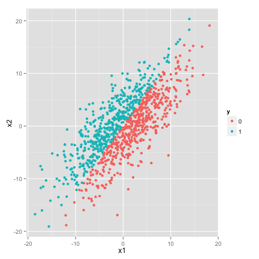
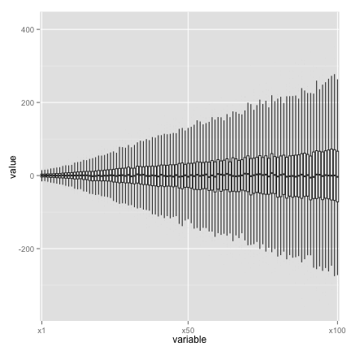
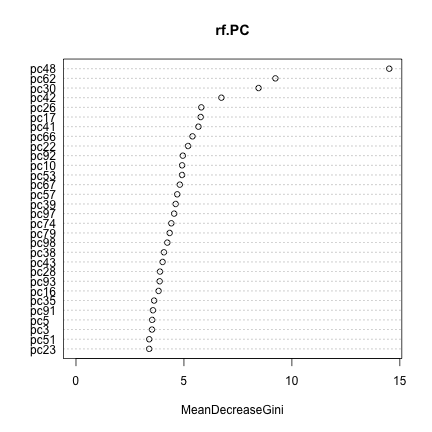

One of the common approaches used when working with big data is 
reducing the number of features through a principal component analysis.
Since it is an unsupervised method though, it may not be a great choice in many 
circumstances. Consider the simple example below


# select the rows and columns
n <- 1000
p <- 100

# generate 1000 rows of random standard normal
Z <- matrix(rnorm(n * p), nrow = n)

# random correlation structure for the rows
A <- matrix(runif(p * p)/p, nrow = p)

# make the variance increase down the diagonal
diag(A) <- 1:p/p

# and give some base line variance
sigma.sq <- 100
A <- sigma.sq * A

# Add the correlation structure for the columns
A.tZ <- A %*% t(Z)

# Now there are features that are correlated
X <- t(A.tZ)

# And make it a dataset
d <- data.frame(X)
names(d) <- paste0("x", 1:p)

# add the response to our data
slope <- 0.8
d$y <- as.factor(as.numeric((d$x1 < slope * d$x2)))


This creates a data set with 100 feature dimensions and a binary classification variable, y.
Additionally, there is a simple relationship between the
classes and the first two features, x1 and x2.


   qplot(x1,x2,color=y,data=d)


However, there is not any kind of relationship between the response and any other
variable. Further, the feature columns that are important are much less noisy that the variables
that are not important (as shown in the following series of boxplots):


   qplot(variable,value,data=melt(d,101,1:100),geom='boxplot',outlier.size=.1) + scale_x_discrete(breaks = c('x1','x50','x100'))


With 98 other features to search through, it may be difficult to
identify this relationship immediately, and initially working with this data
we may hope to reduce the data. 

##Principal Components for data reduction

One popular method for data reduction is principal components. 
Consider a data set with each of p features arranged as columns 
of a matrix (giving us an n by p matrix, as created above).
The basic assumption is 
that for a feature matrix of dimension n by p we can make a set of features 
using the eigenvectors derived from the feature matrix.
By choosing the eigenvectors with the largest k eigenvalues, we can reduce the
number of columns from p to k and still have a set of features that span
the data well (we create a k-dimensional space so that the actual observed
data points in the p-dimensional space are relatively close to a point 
in the smaller space). This is done below:

<!-- plot: R plot (results in document) -->


   #center the variables
   rm=rowMeans(X)
   Xcenter= X - matrix(rep(rm, ncol(X)), nrow=nrow(X))

   #get the eigenvectors
   X.tX = Xcenter%*%t(Xcenter)
   E = eigen(X.tX,TRUE)

   #use the eigenvectors to get the value of each observation at each component
   P=t(E$vectors)
   d.PC = data.frame(P%*%Xcenter)
   names(d.PC) = paste0('pc',1:p)
   d.PC$y = d$y


<!-- http://psych.colorado.edu/wiki/lib/exe/fetch.php?media=labs:learnr:emily_-_principal_components_analysis_in_r:pca_how_to.pdf -->

#Principal components against the data itself
##Support vector machines
Consider using a support vector machine to determine classify
the data. For the raw data, holding out 200 of the 1000 observations,
we have the following results:
<!-- svm: R code (No Results in Document) -->


svm <- svm(y ~ ., data = d[1:800, ])
prediction <- predict(svm, d[801:1000, ])
svm.res <- xtable(table(pred = prediction, true = d$y[801:1000]))


<!-- html table generated in R 3.0.2 by xtable 1.7-1 package -->
<!-- Thu Oct 30 20:13:32 2014 -->
<TABLE border=1>
<TR> <TH>  </TH> <TH> 0 </TH> <TH> 1 </TH>  </TR>
  <TR> <TD align="right"> 0 </TD> <TD align="right">  86 </TD> <TD align="right">   9 </TD> </TR>
  <TR> <TD align="right"> 1 </TD> <TD align="right">  10 </TD> <TD align="right">  95 </TD> </TR>
   </TABLE>

Repeating this process with the principal component version of the data:


svm.PC <- svm(y ~ ., data = d.PC[1:800, ])
prediction <- predict(svm.PC, d.PC[801:1000, ])
svm.PC.res <- xtable(table(pred = prediction, true = d.PC$y[801:1000]))


<TABLE border=1>
<TR> <TH>  </TH> <TH> 0 </TH> <TH> 1 </TH>  </TR>
  <TR> <TD align="right"> 0 </TD> <TD align="right">   0 </TD> <TD align="right">   0 </TD> </TR>
  <TR> <TD align="right"> 1 </TD> <TD align="right">  96 </TD> <TD align="right"> 104 </TD> </TR>
   </TABLE>

##Random forests
<!-- randomForest: R code (No Results in Document) -->
We can repeat the process with random forests, but the results remain essentially the same:


rf <- randomForest(y ~ ., data = d[1:800, ], ntree = 1000, 
    nodesize = 9, mtry = 10)
prediction <- predict(rf, d[801:1000, ])
rf.res <- xtable(table(pred = prediction, true = d$y[801:1000]))


<!-- html table generated in R 3.0.2 by xtable 1.7-1 package -->
<!-- Thu Oct 30 20:13:39 2014 -->
<TABLE border=1>
<TR> <TH>  </TH> <TH> 0 </TH> <TH> 1 </TH>  </TR>
  <TR> <TD align="right"> 0 </TD> <TD align="right">  75 </TD> <TD align="right">  15 </TD> </TR>
  <TR> <TD align="right"> 1 </TD> <TD align="right">  21 </TD> <TD align="right">  89 </TD> </TR>
   </TABLE>


   varImpPlot(rf)


<!-- randomForest: R code (No Results in Document) -->


rf.PC <- randomForest(y ~ ., data = d.PC[1:800, ], 
    ntree = 1000, nodesize = 9, mtry = 10)
prediction <- predict(rf.PC, d.PC[801:1000, ])
rf.PC.res <- xtable(table(pred = prediction, true = d.PC$y[801:1000]))


the results are garbage:
<!-- html table generated in R 3.0.2 by xtable 1.7-1 package -->
<!-- Thu Oct 30 20:13:47 2014 -->
<TABLE border=1>
<TR> <TH>  </TH> <TH> 0 </TH> <TH> 1 </TH>  </TR>
  <TR> <TD align="right"> 0 </TD> <TD align="right">  32 </TD> <TD align="right">  37 </TD> </TR>
  <TR> <TD align="right"> 1 </TD> <TD align="right">  64 </TD> <TD align="right">  67 </TD> </TR>
   </TABLE>

and the importance plot is not about to help:


   varImpPlot(rf.PC)


#Principal components are a terrible first choice for data reduction
This method just turned a solid gold feature into garbage. 
Since the principal components are unsupervised and will select
directions with the most noise first, this is not a surprise.
But they still get discussed commonly in data mining courses, text books,
and so on, and still get used (I imagine to great success?).
We have used them frequently in our data mining competitions.
Still, by modeling this data with PC features instead of the actual data,
the ability to classify the observations erodes to nothing.

This is very disappointing to me, since I at the moment have been working 
on a problem that keeps generating features, and we are well past p > n at
this point. There are many other methods available, though,
and without at least thinking about the methods, the machine learning
techniques that are being used and the possibility
that some features may be better without any adjustments,
there are many reasons to avoid using principal components.
