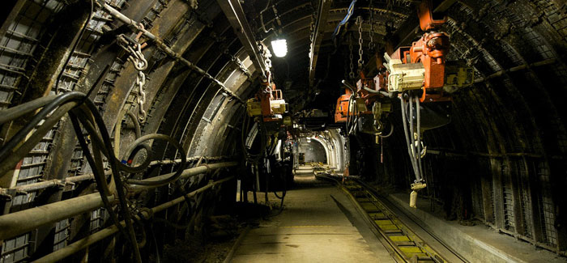

<!DOCTYPE html>
<html>
   <head>
      <link href ="www/css/stat105.css" type="text/css" rel = "stylesheet">
      <style type="text/css">
      @import url(https://fonts.googleapis.com/css?family=Droid+Serif:400,700,400italic);
      @import url(https://fonts.googleapis.com/css?family=Yanone+Kaffeesatz);
      @import url(https://fonts.googleapis.com/css?family=Ubuntu+Mono:400,700,400italic);
      </style>

      <title>STAT 105: Lecture 1</title>
      <meta http-equiv="Content-Type" content="text/html; charset=UTF-8"/>
      <meta name="keywords" content="statistics,engineering,stat105,iastate"/>
      <meta name="description" content="Lecture 1: Statistics and Engineering"/>
      <script type="text/javascript" src="https://cdn.mathjax.org/mathjax/latest/MathJax.js?config=TeX-AMS-MML_HTMLorMML"> </script>
   </head>
   <body>
   <textarea id="source">

name: inverse
layout: true
class: center, middle, inverse
---
# STAT 105: Lecture 1 
## Why Engineers Study Statistics
### Chapter 1: Introduction
.footnote[Course page: [imouzon.github.io/stat105](https://imouzon.github.io/stat105)]
---
# Section 1.1
## Engineering Statistics: What and Why
---
layout: false
.left-column[
  ## What and Why
  ### Engineers In General
]
.right-column[

<center>
   <h2> What Do Engineers Do? </h2>
    
</center>

-  Design/build/operate/improve some system

-  Use both **quantitative theories** (i.e., mathematical) and **scientific principles** (i.e., physics, chemistry, psychology(?)) as a guide

-  Obvious issue - math/science vast, no one knows everything. 

-  Additionally, engineers must work outside of "lab conditions" - there is no control over the environment, the users, the timing, ...
]
---
name: inverse
layout: true
class: center, middle, inverse
---
# So, here's the situation:
## The "system" you want to improve is essentially unique 
## There are competing theories that all seem equal
## Experts disagree bitterly about what to do 
# What's an engineer to do???
---
#Option 1: Just Give Up

## A few drawbacks to this one
---
#Option 2: Gather Some Data

## Figure Out What Really Matters in the System
---
layout: false
.left-column[
## What and Why
### Engineers In General
### Data?
]
.right-column[
## What Do I Mean Data?

Data is **essentially just information** we can record.

Examples are incredibly easy to come up with:

-  Students with majors and courses they enrolled in
```
student   major         course
John      Philosophy    EASY 101
Kate      Engineering   SMRT 500
Mike      Mathematics   MATH 000
```

-  "Thrust Face Runouts" and load method for gears in in a continuous carburizing furnace (Chapter 1, Example 1)
```
Method    Thrust Face Runouts
Laid      5, 8, 8,  9,  9,  9,  9, 10, 10, ..., 19, 27
Hung      7, 8, 8, 10, 10, 10, 10, 11, 11, ..., 31, 36
```
]
---
name: inverse
layout: true
class: center, middle, inverse
---
<center>
   <h1> Getting Data is Easy </h1>
    
   <h1> Getting Good Data is Hard </h1>
</center>
---
layout: false
.left-column[
## Data Guiding Decisions
### Engineers In General
### Data?
### Engineering Statistics
]
.right-column[
## Engineering Statistics

Collecting good data is part of what engineering statistics is concerned with, 
but of course that's only the first part.

Our text book defines it this way:

> **Engineering Statistics** is the study of how *best* to
>
> 1. Collect engineering data
> 2. summarize or describe engineering data, and
> 3. draw formal inferences and practical conclusions on the basis of engineering data
>
> all while recognizing the reality of variation

The "reality of variation" in the Thrust Face Runouts data:
```
Method    Thrust Face Runouts
Laid      5, 8, 8,  9,  9,  9,  9, 10, 10, ..., 19, 27
Hung      7, 8, 8, 10, 10, 10, 10, 11, 11, ..., 31, 36
```
<!--- chunk-label: R code (No Results in Document) -->
```{r cache=FALSE, width=10,height=5}
library(ggplot2)
laid <- c(5,8,8,9,9,9,9,10,10,10,11,11,11,11,11,11,11,12,12,12,12,13,13,13,13,14,14,14,15,15,15,15,16,17,17,18,19,27)
hung <- c(7,8,8,10,10,10,10,11,11,11,12,13,13,13,15,17,17,17,17,18,19,19,20,21,21,21,22,22,22,23,23,23,23,24,27,27,28,31,36)
d <- data.frame(type = c(rep("laid",length(laid)),rep("hung",length(hung))), runout = c(laid,hung))
ggplot(data = d, aes(x=runout,fill= type)) + geom_dotplot(method='histodot',bitwidth=1) + facet_grid(type~.)
```
]


      </textarea>
      <script>
         var slideshow = remark.create();
      </script>
      <script src="https://gnab.github.io/remark/downloads/remark-latest.min.js" type="text/javascript"></script>
      <script type="text/javascript">
         var hljs = remark.highlighter.engine;
      </script>
      <script src="./remark.language.js" type="text/javascript"></script>
      <script type="text/javascript">
         var slideshow = remark.create({
            highlightStyle: 'monokai',
            highlightLanguage: 'remark'
         }) ;
      </script>
   </body>
</html>

