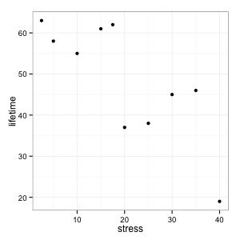

<!DOCTYPE html>
<html>
   <head>
      <link href ="../global/www/css/stat105.css" type="text/css" rel = "stylesheet">
      <style type="text/css">
      @import url(https://fonts.googleapis.com/css?family=Droid+Serif:400,700,400italic);
      @import url(https://fonts.googleapis.com/css?family=Yanone+Kaffeesatz);
      @import url(https://fonts.googleapis.com/css?family=Ubuntu+Mono:400,700,400italic);
      </style>

      <title>STAT 105: Lecture 7</title>
      <meta http-equiv="Content-Type" content="text/html; charset=UTF-8"/>
      <meta name="keywords" content="statistics,engineering,stat105,iastate"/>
      <meta name="description" content="Lecture 12: Relationships Between Factorial Variables"/>
   </head>

   <body>
   <textarea id="source">


name: inverse
layout: true
class: center, middle, inverse
---
# STAT 105: Lecture 8
## Chapter 4: Describing Relationships Between Variables
### Relationships Between Factors
.footnote[Course page: [imouzon.github.io/stat105](https://imouzon.github.io/stat105)]
---
layout:false

.left-column[
## Describing Relationships
### Recap

]
.right-column[


** Last lecture example: Strain on Bars **

We introduced data from an experiment:

|                                      |      |      |      |      |      |      |      |      |      |      |
|--------------------------------------|------|------|------|------|------|------|------|------|------|------|
| **stress** \\((\text{kg/mm}^2)\\)    |  2.5 |  5.0 | 10.0 | 15.0 | 17.5 | 20.0 | 25.0 | 30.0 | 35.0 | 40.0 |
| **lifetime** (hours)                 |  63  |  58  |  55  |  61  |  62  |  37  |  38  |  45  |  46  |  19  |

Judging from the plot, it seems reasonable to assume that there could be an underlying linear relationship between lifetime \\(y\\) and strain (\\(x\\))

<center>
    
</center>

]
---
.left-column[
## Describing Relationships
### Recap

]
.right-column[

** Last lecture example: Strain on Bars **


|                                      |      |      |      |      |      |      |      |      |      |      |
|--------------------------------------|------|------|------|------|------|------|------|------|------|------|
| **stress** \\((\text{kg/mm}^2)\\)    |  2.5 |  5.0 | 10.0 | 15.0 | 17.5 | 20.0 | 25.0 | 30.0 | 35.0 | 40.0 |
| **lifetime** (hours)                 |  63  |  58  |  55  |  61  |  62  |  37  |  38  |  45  |  46  |  19  |

**Theoretical Relationship**
\\[
 y = \beta_0 + \beta_1 \cdot x
\\]

**Observed Relationship**
\begin{align}
y &= \beta_0 + \beta_1 \cdot x + \text{errors} \\\\
  &= \text{signal} + \text{noise} 
\end{align}

**Fitted Relationship**:
\\[
\hat{y} = b\_0 + b\_1 \cdot x 
\\]

]
---
.left-column[
## Describing Relationships
### Recap

]
.right-column[

** Last lecture example: Strain on Bars **


|                                      |      |      |      |      |      |      |      |      |      |      |
|--------------------------------------|------|------|------|------|------|------|------|------|------|------|
| **stress** \\((\text{kg/mm}^2)\\)    |  2.5 |  5.0 | 10.0 | 15.0 | 17.5 | 20.0 | 25.0 | 30.0 | 35.0 | 40.0 |
| **lifetime** (hours)                 |  63  |  58  |  55  |  61  |  62  |  37  |  38  |  45  |  46  |  19  |

Estimating the best slope and intercept using least squares:


<span style = "font-size: 70%">
\begin{align}
b\_0 &= \bar{y}- b\_1 \bar{x} \\\\
b\_1 &= \frac{\sum\_{i = 1}^n y\_i x\_i - n \bar{x} \bar{y}}{\sum\_{i = 1}^n x\_i^2 - n \bar{x}^2} \\\\
     &= \frac{\sum\_{i = 1}^n (x\_i - \bar{x})(y\_i - \bar{y})}{\sum\_{i = 1}^n (x\_i - \bar{x})^2}
\end{align}
</span>

In our case we have the following:


<span style = "font-size: 70%">
\\[
\sum\_{i = 1}^{10} y\_i = 484, 
\sum\_{i = 1}^{10} x\_i = 200, 
\sum\_{i = 1}^{10} x\_i y\_i = 8407.5, 
\sum\_{i = 1}^{10} x\_i^2 = 5412.5, 
\\]
</span>


]
---
.left-column[
## Describing Relationships
### Recap

]
.right-column[

** Last lecture example: Strain on Bars **


|                                      |      |      |      |      |      |      |      |      |      |      |
|--------------------------------------|------|------|------|------|------|------|------|------|------|------|
| **stress** \\((\text{kg/mm}^2)\\)    |  2.5 |  5.0 | 10.0 | 15.0 | 17.5 | 20.0 | 25.0 | 30.0 | 35.0 | 40.0 |
| **lifetime** (hours)                 |  63  |  58  |  55  |  61  |  62  |  37  |  38  |  45  |  46  |  19  |


<span style = "font-size: 70%">
\\[
\sum\_{i = 1}^{10} y\_i = 484, 
\sum\_{i = 1}^{10} x\_i = 200, 
\sum\_{i = 1}^{10} x\_i y\_i = 8407.5, 
\sum\_{i = 1}^{10} x\_i^2 = 5412.5, 
\\]
</span>

Using this we can estimate \\(b\_1\\):

<span style = "font-size: 80%">
\begin{align}
b\_1 &= \frac{\sum\_{i = 1}^n y\_i x\_i - n \bar{x} \bar{y}}{\sum\_{i = 1}^n x\_i^2 - n \bar{x}^2} \\\\
     &= \frac{8407.5 - 10 \left(\frac{200}{10}\right) \left(\frac{484}{10}\right)}{5412.5 - 10 \left(\frac{200}{10}\right)^2} \\\\
     &= \frac{-1272.5}{1412.5} \\\\
     &\approx -0.9009
end{align}
</span>

]
---
.left-column[
## Describing Relationships
### Recap
]
.right-column[

** Last lecture example: Strain on Bars **


|                                      |      |      |      |      |      |      |      |      |      |      |
|--------------------------------------|------|------|------|------|------|------|------|------|------|------|
| **stress** \\((\text{kg/mm}^2)\\)    |  2.5 |  5.0 | 10.0 | 15.0 | 17.5 | 20.0 | 25.0 | 30.0 | 35.0 | 40.0 |
| **lifetime** (hours)                 |  63  |  58  |  55  |  61  |  62  |  37  |  38  |  45  |  46  |  19  |


<span style = "font-size: 70%">
\\[
\sum\_{i = 1}^{10} y\_i = 484, 
\sum\_{i = 1}^{10} x\_i = 200, 
\sum\_{i = 1}^{10} x\_i y\_i = 8407.5, 
\sum\_{i = 1}^{10} x\_i^2 = 5412.5, 
\\]
</span>

And using \\(b\_1\\) we can estimate \\(b\_0\\):

<span style = "font-size: 80%">
\begin{align}
b\_0 &= \bar{y} - b\_1 \bar{x} \\\\
     &= \left(\frac{484}{10}\right) - b\_1 \left(\frac{200}{10}\right) \\\\
     &= 48.4 - \left(\frac{-1272.5}{1412.5}\right) 20.0\\\\
     &= 66.4177
\end{align}
</span>

Which gives us the **Fitted Relationship**:

\\[
\hat{y} = 66.4177 - 0.9009 x
\\]
]
---
.left-column[
## Describing Relationships
### Recap
### Using JMP
]
.right-column[

**Topics to be covered in JMP**

-  Fitting linear relationships
-  Describing quality of fit (correlation, \\(R^2\\)
-  Fitting relationships using multiple variables
-  Fitting non-linear relationships

]


</textarea>
<!-- load remark -->
<script src="https://gnab.github.io/remark/downloads/remark-latest.min.js" type="text/javascript"></script>

<!-- load mathjax -->
<script type="text/javascript" src="http://cdn.mathjax.org/mathjax/latest/MathJax.js?config=TeX-AMS-MML_HTMLorMML&delayStartupUntil=configured"></script>

<!-- Initialize (has to go in <script> tag **without** SRC attribute) -->
<script type="text/javascript">
   // Create slideshow
   var slideshow = remark.create({
      // This BREAKS MathJax: 
      // highlightLanguage: 'Python'

      // You have to tag every code block with python, like so:
      //
      // ```python
      // def add(a, b):
      //     return a + b
      // ```
   });

   // Setup MathJax
   MathJax.Hub.Config({
      tex2jax: {
         skipTags: ['script', 'noscript', 'style', 'textarea', 'pre']
      }
   });
   MathJax.Hub.Queue(function() {
      $(MathJax.Hub.getAllJax()).map(function(index, elem) {
         return(elem.SourceElement());
      }).parent().addClass('has-jax');
   });
   MathJax.Hub.Queue(function() {
      $(MathJax.Hub.getAllJax()).map(function(index, elem) {
         return(elem.SourceElement());
      }).parent().addClass('has-jax');
   });

   MathJax.Hub.Configured();
</script>
